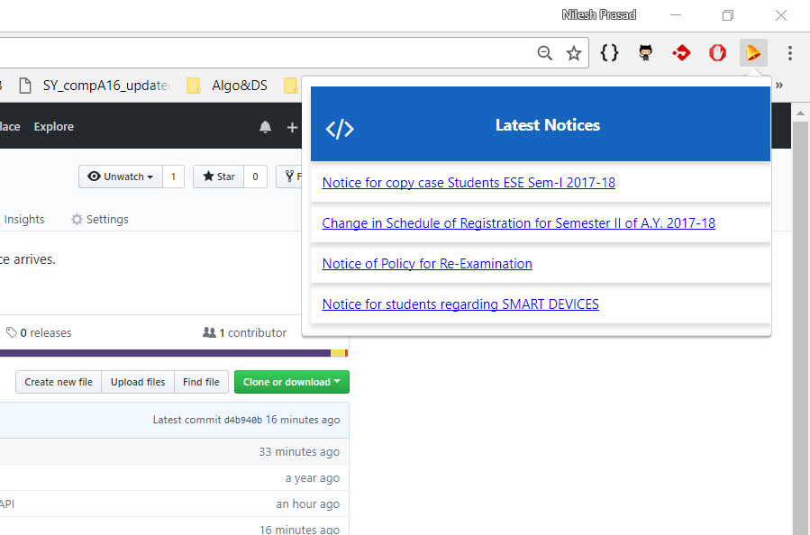

# NoticeFeed-VITPune

This Chrome Extension is developed to keep me updated with any new notices posted on college website. I did Web Scraping to fetch all notices from College Website and then developed an API using PHP to access notices efficiently and to keep extension's code clean. This extension parses NoticeFeed-API and sends me desktop notifications (Chrome Rich Notification) when any new notices are posted. Complete list of notices are displayed as well to download them anytime, just through an icon on the Chrome Browser.

## Screenshots

#### Shows Complete List of Notices

## Installation
1. [Download Zip Folder](https://github.com/nileshprasad137/NoticeFeed-VITPune/archive/master.zip)
2. Extract the folder.
3. Go to Chrome -> More Tools -> Extensions.
4. Check on developer mode.
5. Load unpacked extension.
6. Select NoticeFeed-VITPune folder.

## License

This Chrome Extension is licensed under the [MIT license] (https://opensource.org/licenses/MIT).

Feel free to contribute !